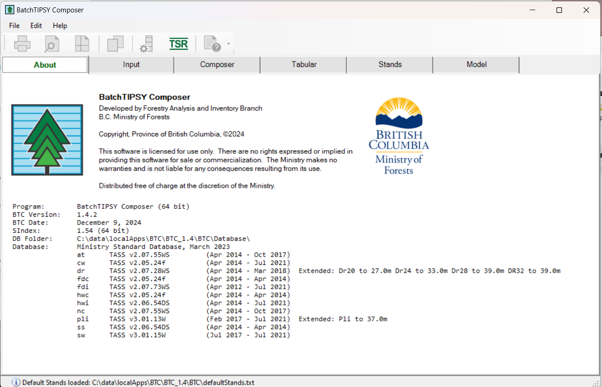
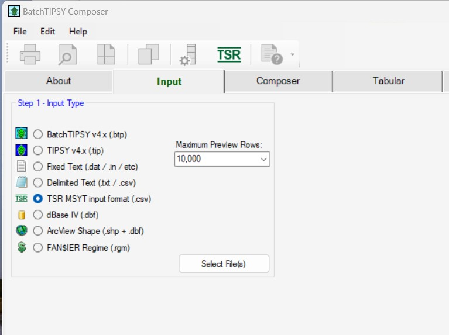
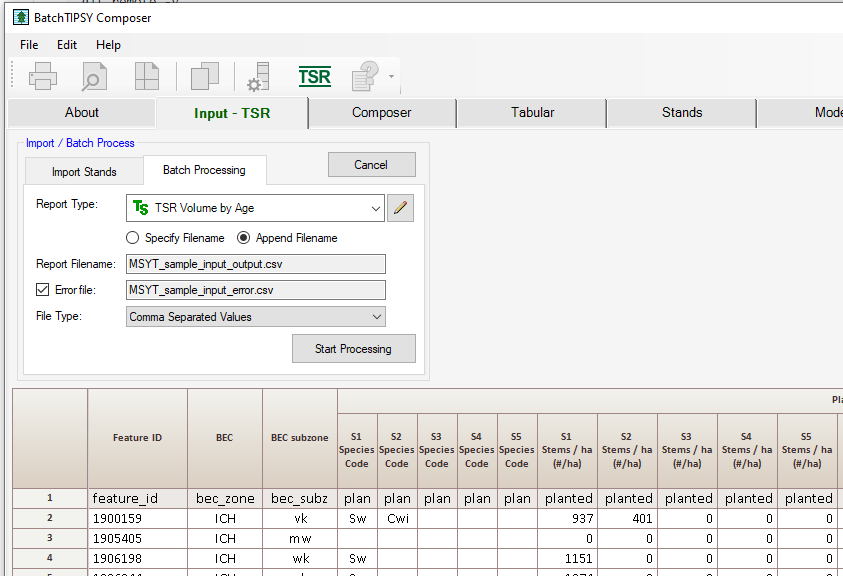
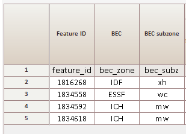
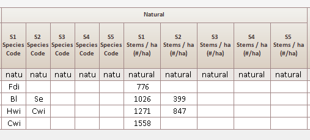
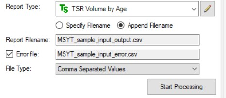
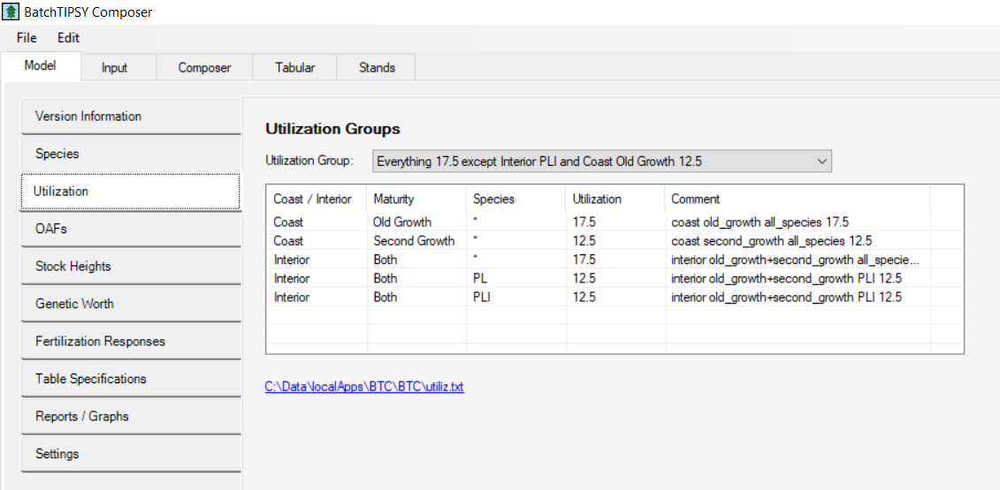
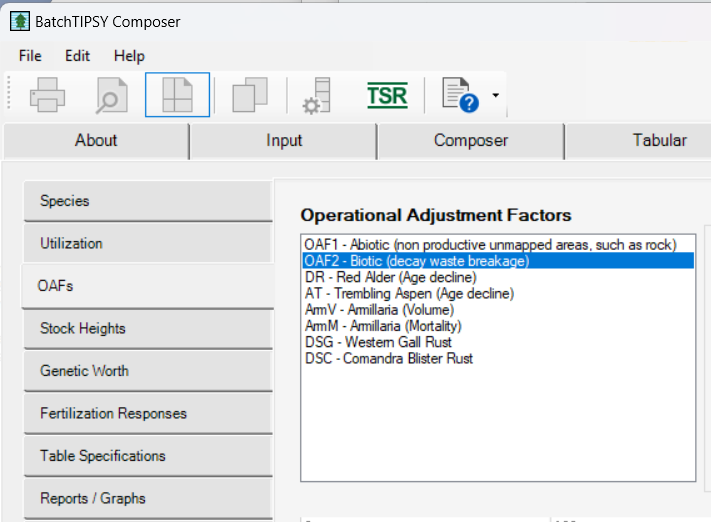
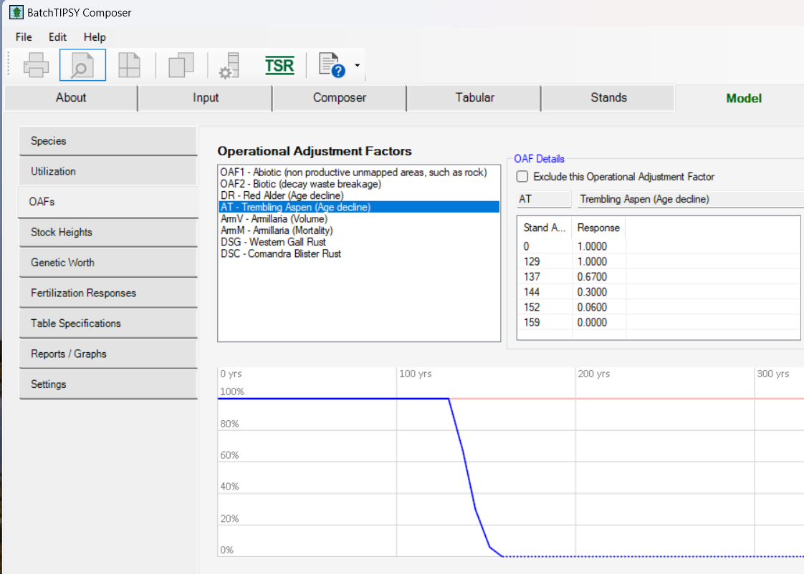
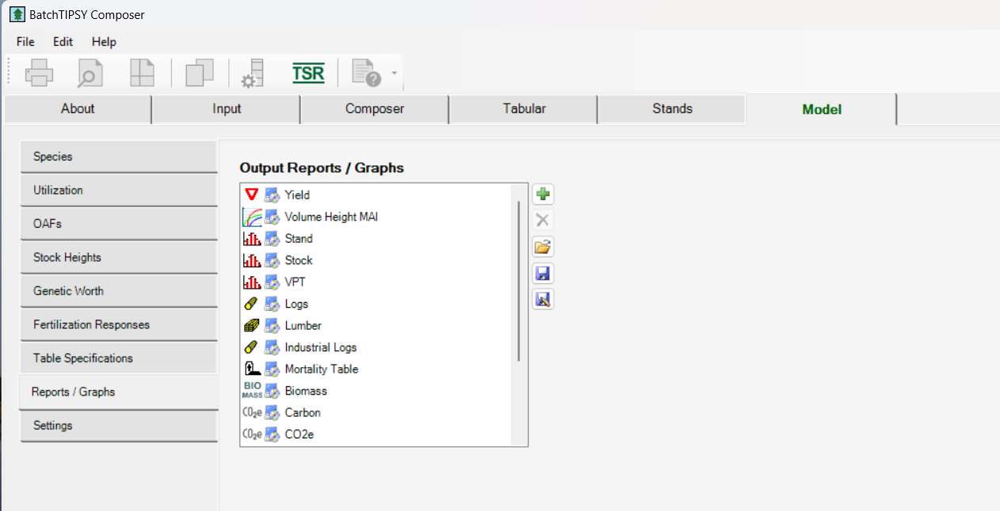

--- 
title: "Re-Introduction to Batch Tipsy Composer"
author: "Dave Waddell, RPF, MF"
date: "2025-01-22"
site: bookdown::bookdown_site
description: |
  This is the bookdown for Intro to BTC
  The HTML output format for this example is bookdown::gitbook,
  set in the _output.yml file.
---


# Introduction 


Batch Tipsy Composer (BTC) has been around since the first production runs of the MSYTs for TSR.  It initially provided an efficient CSV interface that got around the strict and old school format specification for the batch version of Tipsy.  

While many of you are probably familiar with the Tipsy Interface, BTC has a much different interface.  




Please note that this is version 1.4.2, Dec 9, 2024.  


# BTC: Software Install & Sample Data

BTC is available here: 


https://www2.gov.bc.ca/gov/content/industry/forestry/managing-our-forest-resources/forest-inventory/growth-and-yield-modelling/

Clarify that this is the BTC stand alone installer.

Copy to your local drive c:/data/localApps

- BTC1.4-20241209.msi [get name]

Install to location:

C:/data/localApps/BTC/BTC_1.4    

Also grab the sample data file from  [to be defined] 


- MSYT_sample.csv


# BTC Input Data 

## Input TAB 

The Input tab is used to select Input format for creating yield tables  


Clicking on the Input TAB allows you to select the input file type and select the input file:




- Tick the radiobutton: TSR MSYT input format (.csv)
- Click the Select Files(s) button

Note that clicking on TSR button will take you directly to: Select TSR MSYT input format files to import"

## Select Report Type  



Note that the report type defaults to TSR Volume by Age.  

Other types of reports are listed but the main selections are:

- TSR Volume by Age 
	- volume, height
- FLP Volume by Age
	- gross volume, crown_closure
	
Selecting the TSR report type sets defaults for Utilization and OAFs (see below).  
	
## Select Output File Names 

Output file names can be modified as required, but for TSR:

Input: MSYT_sample_input.csv  
Output: MSYT_sample_input_output.csv  
Error: MSYT_sample_input_error.csv  


# BTC Input Data Format

Once you have selected your input file the first few rows of data will appear.  

It is important to note that there are 4 main sections to each input row:

## Identifier Section



The first section supplies the row identifier (in this case feature_id), as well as the BEC zone and subzone.  
Note that BTC has a know list of BEC and if supplied with something unknown an ERROR will occur.

The first column in the CSV is always the name of the identifier.  Accepted values:

| Identifier |
|:--|
|feature_id |
|opening_id |
|id |


## Planted Composition


The second section represents the planted component of the stand and shows:

| Planted Component |
|:--|
|Planted Species (1-5) |
|Planted Species Density (1-5) |
|Genetic Worth by species (1-5) |
|Planting Delay |
|Percent Planted (0-100) |

## Natural Composition


The third section represents the natural component of the stands and shows:

| Natural Component |
|:--|
|Natural Species (1-5) |
|Natural Species Density (1-5) |

## Other attribution


The fourth section shows:

| Attribute | Description |
|:--|:--|
|OAF1 | Standard OAF 1 15% |
|OAF2 | Standard Oaf 2 5% |
|Opening_id | optional | 
|||
| vri reference age | backgrow attribution |
| vri ref density | backgrow attribution | 
|||
|Site Index values|  for all 22 PSPL species |

### Backgrow attribution

The BTC backgrow function is used for stands harvested prior to 1987 only.

- vri reference age 
- vri ref density 


The reference age is the age at which the density is derived.  

These attributes control the backgrow function to take a stand at some age and backgrow to derive initial starting conditions for a MSYT.


### Site Index by Species

Site index values for 22 species are derived from the PSPL data.  


# BTC output

Once you have selected the input file and the file type, click Start Processing




## Output Screen


Note at the bottom that it lists:

- file names
- Warnings and Errors.  

In this case there were none.  

## Output Format 

Output is single row per identifier,  with:

- merch conifer volume (MVcon_) at age 0-120
- merch deciduous volume (MVdec_) at age 0-120
- conifer height (HTcon_) at age 0-120
- deciduous height (HTdec_) at age 0-120

 

## Height

Height output is the average height.  


Beware of the Dr and At mortality OAFs.  They can set the deciduous height to zero with unintended consequences.  


# BTC Errors & warnings

If you are running BTC with custom data, you may encounter either a ERROR or  WARNING messages.  
The count will appear in the processing window.  


There are warnings for:

- site index too high
- site index too low
- exceeding maximum density for a species
- going below the minimum density for a species

In theory, for the Provincial release, there should be no errors and the warnings have been examined and accounted for.  

High site, the site index gets capped at the max allowed.  
Reduced stems, means we’re using the max stems available in the database

Low site if you get a warning, the species won’t be contributing any volume.  

## Specific Errors and Warning

### Natural component in a 100% Planted Stand: 

| Context| Description|
|:--|:--|
|Warning	|Ignoring TU	Species information has been entered for the 'Natural' treatment unit which does not occupy any area!| 


BTC will only ignore the Natural component of a stand when the planted percent is 100%.  
When planted percent is less than 100% the natural component is included in the volume generation.

### Site index of 0 or NULL for a required species

| Context| Description|
|:--|:--|
|Error	|Site index out of range	The site index for species 'Pl' is set to '0', it must be a value between 5 and 60.|


# LOG Files


LOG files are written to the same location as the input files.    
They are given a date stamped name and can be read with any standard text editor.  

LOG files contain:  

Version Information:  

Program:	BatchTIPSY Composer (64 bit)  
Version:	1.4.2.0  
VerDate:	Dec 9, 2024  
SIndex: 	1.54  
Started:	Jan 8, 2025 13:15:13  
Database:	Ministry Standard Database, March 2023  

Report Type:    

Report:	TSR Volume by Age  
MVcon {yr}	Volume (Conifer / Automatic utilization)  
MVdec {yr}	Volume (Deciduous / Automatic utilization)  
HTcon {yr}	Height (Conifer / Automatic utilization)  
HTdec {yr}	Height (Deciduous / Automatic utilization)  


Utilization settings:   (Note that these are the defaults for TSR Report type)  

Utilization Group:	Coast 12.5 / Interior 17.5 except PLI 12.5  
	coast conifer+deciduous 12.5  
	interior conifer+deciduous 17.5  
	interior PL 12.5  
	interior PLI 12.5  
	
	
Oaf settings:      

OAFs:  
OAF1	Default 0.85 / Reading 'OAF1'  <<< read from input file  
OAF2	Default 0.95 / Reading 'OAF2'  <<< read from input file  
DR	'Volume Curve' = DR  (see below)  
AT	'Volume Curve' = AT  (see below)  
ArmV	Default Off  
ArmM	Default Off  
DSG	Default Off  
DSC	Default Off  


# Model TAB  

If you want to check on other features, click on the Model TAB:


## Utilization

The default should be set to TSR utilization specifications.  



The default should be: Coast 12.5 / Interior 17.5 except PLI 12.5

This can be interpreted as:

- Interior Pl: 12.5
- Interior Other Species: 17.5
- Coast: All species 12.5

- Deciduous Interior : 17.5
- Deciduous Coast: 12.5


## OAFs

BTC has a variety of OAFs that are user selectable:



In TSR, the following are the defaults:

- OAF1
- OAF2
- DR
- AT

Note that in the TSR format, the specification of OAF 1 and 2 in the input data is required.  Otherwise, OAFs are ignored.  


The other OAFs:

- AmV
- AmM
- DSG
- CSC

require local information and are not normally used.  

We are using the OAFS provided for Alder (DR) and Aspen (AT).  Note that in the volume output tables, you will observe the decline in deciduous volume.  

### DR OAF


### AT OAF




## Genetic Worth

This is overwritten by the 5 genetic worth columns in the input table.  


## Table Specifications

BTC tables are capped at age = 120.  This was a group decision that included the Stand Development Modelling group, the YSM group and TSR folk.  

The default setting for BTC should be: 


Stands are capped at 120 years and the age increment is 10.

Note that if input is selected to be TSR MSYT input format, then this is automatically the setting.  


## Reports / Graphs



This section details all the information that CAN be reported on.   
For standardized TSR MSYTs, only volumes and heights are reported by age.


# BTC in true BATCH mode

BTC can now be called using the command line interface (CLI).


For an R session:

```
# define where the executable is located
exe_location <- 'C:/data/localApps/BTC/BTC_1.4/BTC/TIPSYbtc.exe'

# define the input file
input_file <- paste0(base_dir,'/MSYT_prov_current_input.csv')

# define the output file
output_file <- paste0(base_dir,'/MSYT_prov_current_input_output.csv')

# define the error file
error_file <- paste0(base_dir,'/MSYT_prov_current_input_error.csv')

# define the argument list
arguments <- c('/TSR',input_file,output_file,error_file)

# check that the input file exists
if (file.exists(input_file)) {
  # systems call
  x <- system2(exe_location,args=arguments)
}

```

** Note:  
system2 is used so that a list of separate arguments can be provided.  
system takes the command a a single string.  

For a CLI (Command Line Interface aka CONSOLE)  

```
C:> C:/data/localApps/BTC/BTC_1.4/BTC/TIPSYbtc.exe /TSR  (input file)

```


If no output or error file is specified, the standard names are applied.  


# ERRORS and WARNINGS


## Caution

This has been a very short introduction to the potential set of ERRORS and WARNINGS.  

The MSYT Process provided sets of BTC inputs and outputs are error free.   

If you choose to deviate from these, then you may encounter additional errors.  

In general, a quick look at the requested stand attribution will provide insight into the problem.  However, if the problem persists, then the Stand Management Group should be contacted for advice.  

## Help

For BTC and TIPSY support, please contact:  

Stand Development Modelling Team Lead  
Catherine BealleStatland  
Catherine.BealleStatland@gov.bc.ca  
778-974-5634   

Alternatively:  

Growth and Yield Applications Specialist
Yanguo Qin  
Yanguo.Qin@gov.bc.ca  


# Questions?


This presentation is available here: 

https://dvwaddell.github.io/BTC_MSYT/


Author: Dave Waddell, RPF, MF  
Contact: dvwaddell@gmail.com  

Powered by:  


 ")
